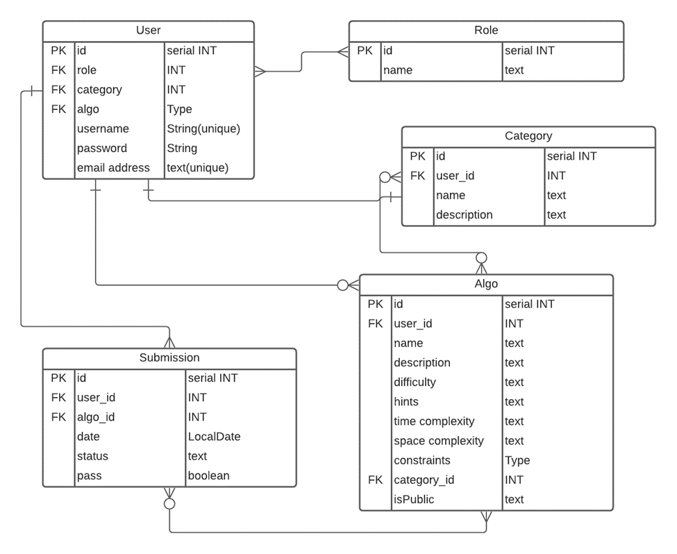
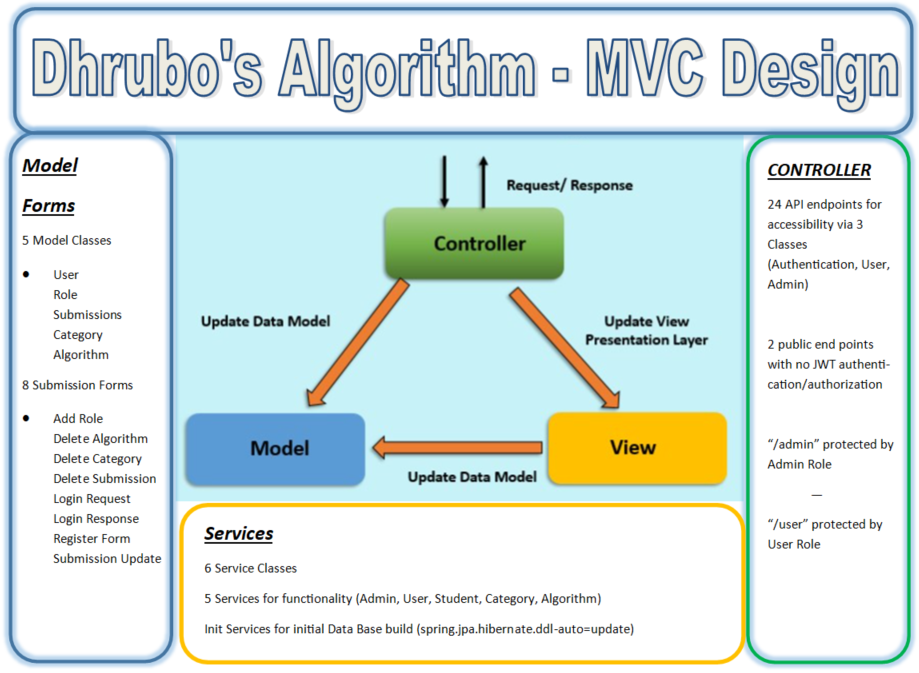

# paypal-java-project-2

### Set Up
1. Create a new database called [ algorithm ] in postgres and connect to it. 

    a. \c algorithm

## **Welcome to Dhrubo's Algorithm Project with Java Spring Boot**

This project involved using a REST API for an algorithm database which allows for users to
view and submit answers to posted agorithms. The database has endpoints designed for users 
and endpoints designed for admins, which require proper authentication using a JSON Web Token.     

In Dhrubo's Algorithm app you will be able to challenge yourself in solving everyday algorithm's.
This app will let users register or login to see the algorithm challenges that have been
posted by the Drubo. The users will be able to submit their Algo solutions or
get elevated permissions to become and admin. The users will be to view their submissions but
will not have access to view all user submissions.

Dhrubo will have the ability to login and see all the users who have registered. 
In addition, Dhrubo will be able to elevate normal users to admins by updating their official 
role. 

The admin has the permission to add, update, delete and create new categories or algorithm's.
The admin will also be able to change the status of an algo submission from "pending" to "completed".
Only the admin has access to view submissions from every user. 

## Entity Relationship Diagram (ERD):

Our initial ERD diagram contained a one to many relationship between a User and Submissions, Categories
and Algorithms. The User also had a one to one relationship with Role. 

## Model View Controller System Design (MVC):
This project was built using the MVC design, implimenting a Model, View, and Controller class. 
Main objective of this structure is "Seperation of Concerns" allowing each layer of the application communicate with other layers for data logic and data access and abstraction.
This project consists of: 
1. 5 Model Classes, 
2. 8 different types of Forms for building and sending JSON body objects
3. 6 Service Classes - 5 for Authentication/Authorization - and business logic
   1. 1 Service Class for Database initialization on application startup
4. Controller had 24 api endpoints, 2 were public with no restrictions
   1. 21 endpoints were behind authorization layers based off ROLE name
      1. Logic is found inside SecurityConfig class on HTTP access controls.

## Endpoints

| ENDPOINT | FUNCTIONALITY | ACCESS |
| --- | :--- | :--- |
| POST _/api/register_ | Register a User | PUBLIC |
| POST _/api/login_ | Log in as User | PUBLIC |
| GET _/admin/getusers_ | Get All Users | ADMIN |
| GET _/admin/getUser/{userId}_ | Get A User | ADMIN |
| POST _/admin/user/add_ | ADD A User | ADMIN |
| POST _/admin/role/add_ | ADD A Role | ADMIN |
| POST _/admin/adduserrole_ | ADD A Role to User | ADMIN |
| GET _/admin/getsubmissions_ | Get All Submissions | ADMIN |
| GET _/admin/pending_ | Get All Pending Submissions | ADMIN |
| PUT _/admin/submissions_ | UPDATE A Submission | ADMIN |
| DELETE _/admin/submissions_ | DELETE A Submission | ADMIN |
| POST _/admin/createcategory_ | CREATE A Category | ADMIN |
| GET _/admin/categories_ | GET ALL Categories | ADMIN |
| GET _/admin/category/{categoryId}_ | GET A Category | ADMIN |
| PUT _/admin/categories/{categoryId}_ | UPDATE A Category | ADMIN |
| DELETE _/admin/deletecategory_ | DELETE A Category | ADMIN |
| GET _/admin/categories/{categoryId}/algorithms_ | GET ALL Algorithms in a Category | ADMIN |
| GET _/admin/categories/{categoryId}/algorithms/{algorithmId}_ | GET An Algorithm | ADMIN |
| POST _/admin/{categoryName}/createalgorithm_ | CREATE An Algorithm | ADMIN |
| PUT _/admin/categories/{categoryId}/algorithms/{algorithmId}_ | UPDATE An Algorithm | ADMIN |
| DELETE _/admin/deletealgorithm_ | DELETE An Algorithm | ADMIN |
| POST _/users/{categoryName}/{algorithmName}/submit_ | CREATE A Submission | USER |
| GET _/users/algorithms_ | GET All Algorithms | USER |
| GET _/users/getsubmissions_ | GET All Submissions for User | USER |

## System Tools Used

|  |  |
| --- | :--- |
| Spring Boot | IntelliJ IDEA/Java 11 and 17 |
| Apache Maven | Json Web Tokens |
| Postman | Postgres |
| Lucid App | Google |
| Oracle Docs | Leet Code |

 
 
    

## User Stories

| |
| --- |
|1. A user can have an admin or normal user role.
|2. One user can have one role.
|3. One role can be assigned to one user.
|4. As an admin user, I can create categories.
|5. As an admin user, I can create algorithms.
|6. As an admin user, I can update the submission entries (status)(pass/fail).
|7. As a user, I can view the various categories.
|8. As a user, I can submit my algorithm.
|9. As a user, I can view public algorithms.
|10. As a user, I can view all of my submissions.
|11. As a user, I am able to login.

## Project Challenges

1. A challenge we faced was creating an admin role vs. a normal user. This problem was 
resolved when the API paths were changed from /user to /admin, which allowed only an admin to access
the different API's. 

2. Creating a user with an assigned role as opposed to a user with a "null" value as this caused errors. 
This required an auto assigned role of "user" when registering, which can then be elevated to admin.

3. Using one Github repository for two users. Crated a protocol where a Git `PUll` request was made prior
to any updates being completed as this ensured the most recent code was updated. Also ensured to commit
and create a `PUSH` request after any updates to have the most updated version in Git. 

4. Adding claims - One of the initial goals of the projects was to add authorizations insde the JWT token.
   These Authorizations would be the Authorization for Access after Authentication was completed.  Figuring out the correct way to add inside the UserDetails class "Granted Authorities" variable was challenging.  
   We started with 1 to 1 relationship for User <> Role and added the single Role to the Granted Authorities list, but when we wanted to add ManyToMany connection, we had to take a loop (for each Role assigned to user) and add it to a list.
   Once the JWT Token was initiated we could pull ROLE from the token inside claims.  With the scope of this project, we went with a more bare metal approach and utilized 
   /admin can be accessed by 'hasRole("ROLE_ADMIN")' as our approach.  We left the code in the Granted Authorities Method for visibility and goal to improve in future pushes

5. Creating finals - Some of our initial approaches in this project were to learn about new plugins/dependencies that could help us reduce code.  We chose Lambok as a dependency, which allowed us to utilise notations such as 
   1. @NoRequiredArgs - which would remove the need to @Autowired an object to the class
      1. With this approach we ran into a few endless loops of objects calling the same objects in a loop.  
   2. @Data - This tag allowed us to not need to generate Getters/Setters for objects.  For testing, we implemented this on a few classes (Mainly Forms) for functionality
   3. @Transactional - This tag was used on Service classes, and once a repository entry was updated, we didn't need to call Save/Delete methods
      1. Learning point and challenge was where to add these and would they really work?
      

6. Navigating JPA stack errors. Nested exception - MOST OF OUR DEBUGGING TIME WAS SPENT HERE (But we learned a tremendous amount READ YOUR LOGS PEOPLE!)
   1. Main issues with JPA and databases, is if you want to change a field name on a database that is already built, it causes build errors, or some sort of duplicate column.
   2. When reviewing an error, it is easy to traverse to the root cause, but learning how to review Nested Errors was difficult (Error was caused from a Nested Dependency > Error was caused from a Nested Dependence > and so on...)

7. If we could go back and restart the process, setting your database to CREATE was very helpful.  Allowing us to make rapid changes and starting fresh was key to fast engineering and testing.
   1. Troubles of this was how would we implement this data at the start of Run.  
      1. We created a @Bean to be implemented first that would add all the data.  
         1. We went with this route mainly due to Password.encode() method to store all passwords encrypted.
            1. If we utilized just a file, all passwords would be plain test.

