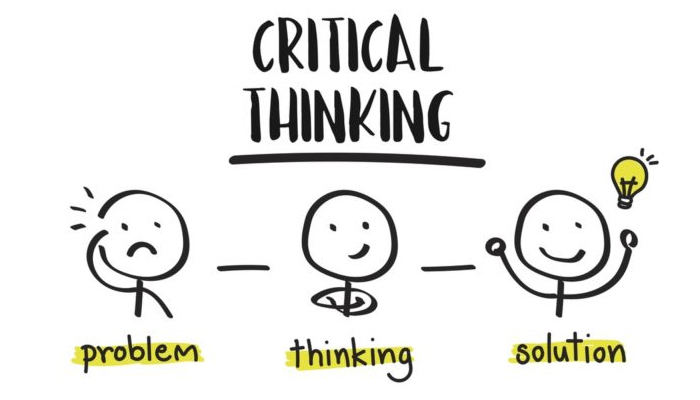
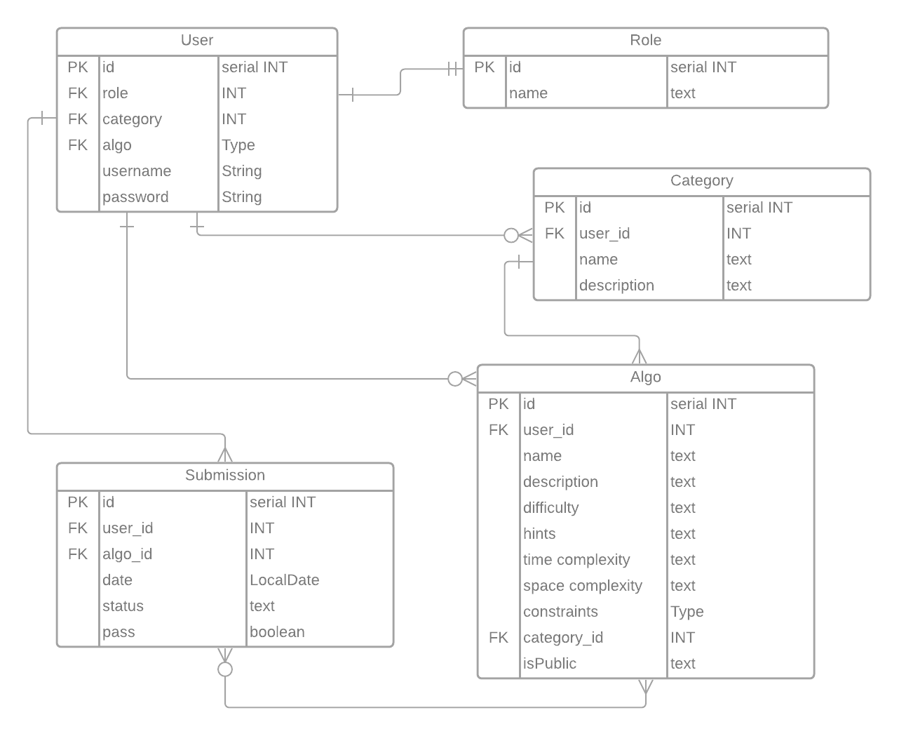

# paypal-java-project-2

### Set Up
1. Create a new database called Algorithm in postgres and connect to it. 

    a. \c Algorithm

    b. run the following code:

## **Welcome to Dhrubo's Algorithm Project with Java Spring Boot**

This project involved using a REST API for an algorithm database which allows for users to
view and submit answers to posted agorithms. The database has endpoints designed for users 
and endpoints designed for admins, which require proper authentication using a JSON Web Token.     

In Dhrubo's Algorithm app you will be able to challenge yourself in solving everyday algorithm's.
This app will let users register or login to see the algorithm challenges that have been
posted by the Drubo. The users will be able to submit their Algo solutions or
get elevated permissions to become and admin. The users will be to view their submissions but
will not have access to view all user submissions.

Dhrubo will have the ability to login and see all the users who have registered. 
In addition, Dhrubo will be able to elevate normal users to admins by updating their official 
role. 

The admin has the permission to add, update, delete and create new categories or algorithm's.
The admin will also be able to change the status of an algo submission from "pending" to "completed".
Only the admin has access to view submissions from every user. 

## Entity Relationship Diagram (ERD):

Our initial ERD diagram contained a one to many relationship between a User and Submissions, Categories
and Algorithms. The User also had a one to one relationship with Role. 

## Endpoints

## System Tools Used

|  |  |
| --- | :--- |
| Spring Boot | IntelliJ IDEA/Java 11 and 17 |
| Apache Maven | Json Web Tokens |
| Postman | Postgres |
| Lucid App | Google |
| Oracle Docs | Leet Code |

 
 
    

## User Stories

| |
| --- |
|1. A user can have an admin or normal user role.
|2. One user can have one role.
|3. One role can be assigned to one user.
|4. As an admin user, I can create categories.
|5. As an admin user, I can create algorithms.
|6. As an admin user, I can update the submission entries (status)(pass/fail).
|7. As a user, I can view the various categories.
|8. As a user, I can submit my algorithm.
|9. As a user, I can view public algorithms.
|10. As a user, I can view all of my submissions.
|11. As a user, I am able to login.

## Project Challenges

1. A challenge we faced was creating an admin role vs. a normal user. This problem was 
resolved when the API paths were changed from /user to /admin, which allowed only an admin to access
the different API's. 

2. Creating a user with an assigned role as opposed to a user with a "null" value as this caused errors. 
This required an auto assigned role of "user" when registering, which can then be elevated to admin.

3. Using one Github repository for two users. Crated a protocol where a Git `PUll` request was made prior
to any updates being completed as this ensured the most recent code was updated. Also ensured to commit
and create a `PUSH` request after any updates to have the most updated version in Git. 

4. Adding claims (Mattew James)

5. Creating finals (Matthew James)

6. Navigating JPA stack errors. Nested exception (Matthew James)

